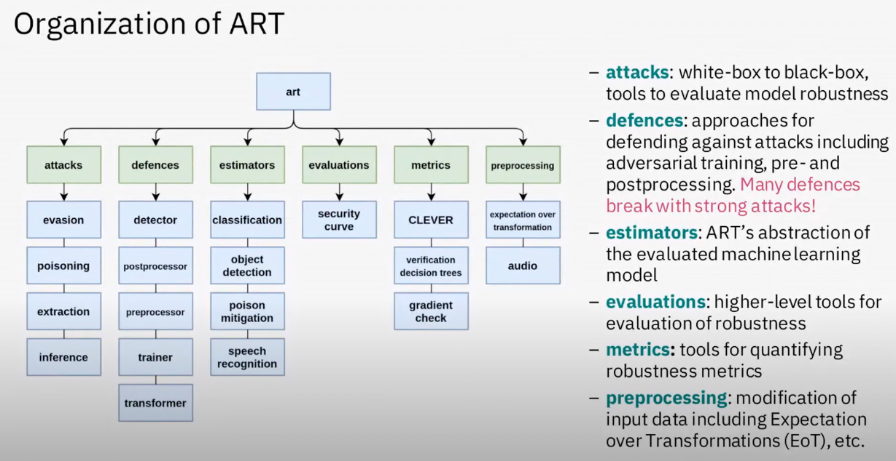
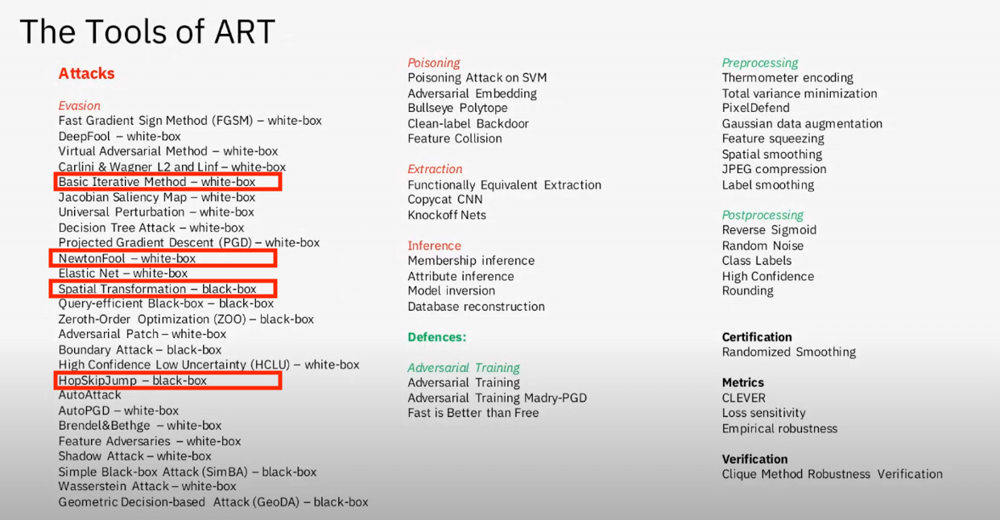

# Adversarial Robustness Toolbox 

[Adversarial Robustness Toolbox (ART)](https://github.com/Trusted-AI/adversarial-robustness-toolbox) is a Python library for Machine Learning Security. ART provides tools that enable developers and researchers to defend and evaluate Machine Learning models and applications against the adversarial threats of Evasion, Poisoning, Extraction, and Inference. 

Here I will document how this tool works and how it can be used in my research. 

## IBM Research AI

Modern AI systems are achieving human level performance or cognitive tasks like recognizing images and objects. This evolution  holds the promisse of helping us understand and perhaps solve the environemntal, economic and societal changes of the 21st century.

Many breakthroughs in AI are obtained using Deep Neural Networks or DNNs. 

DNNs are complex machine learning models that are a bit like  intereconnected neurons  in the brain, capable of dealing with high dimensional inputs like photos.

DNNs are susceptible to attack specifically where an attacker can modify an input to produce an incorrect response, by adding an imperceptible amount of noise to an image it completely alters the internal activations in the DNN leading the DNN to misclassify the image.

The attackers can defeat visual recognition systems in autonomous vehicles by sticking patches to traffic signs.

This poses a real threat to the deployement of AI and security critical applications.

IBM ART helps to mitigate those threats.

ART is an open source library designed to help researchers and developers in defending DNNs against attacks allowing them to develop and benchmark novel defences against state-of-the-art attacks.

Defending DNNs against adversarial attacks has three elements:
1 - hardening models
2 - measuring robustness
3 - detecting adversarial inputs at the test time

1 - hardening models - common approaches include filtering the inputs or changing the internal architecture at the DNN such that the adversarial samples do not propagate to the internal hidden layers.

The robusteness of a DNN can be assessed by measuring the loss of accuracy on adversarial inputs

Run time detections can be applied to flag any inputs and adversary may have tampered with by identifying abnormal activations caused by the adversarial inputs.

ART provides a testbed for researchers to design comprehensive defence methods and for developers to deploy them in real-world AI systems.

This project looks into the deployment of secure AI in real world applications.

REPEATS

The 8 Linux Foundation AI (LFAI) principles for Trusted AI

Reproducibility
Robustness
Equitability
Privacy
Explainability
Accountability
Transparency
Security

Adversarial threats against ML models and applications have a wide variety of attack vectors:

- Evasion - modify input to influence model
- Poisoning - modify training data to add backdoor
- Extraction - steal a proprietary model
- Inference - learn information on private data

The combination of them makes them stronger.

ART is a python library for ML security, for all tasks includind classification, object detection, generation, encoding, certification, etc.

For all frameworkds: TensorFlow, Keras, PyTorch, MXNet, scikit-learn, XGBoost, LightGBM, CatBoost, GPy

For all data, images, videos, tables, audio, etx

[Source](https://www.youtube.com/watch?v=4oUGUC4hIhI)

[Source](https://www.youtube.com/watch?v=4oUGUC4hIhI)

# Tools building on ART

## [Armory](gituhub.com/twosixlabs/armory)
* Adversarial Robustness Evaluation Test Bed
* Run evaluations with ART locally or scaled in the cloud using Docker containers 

## [Counterfit](github.com/Azure/counterfit)
* Command line tool to simplify running evaluations with ART in terminals.

## [ai-privacy-toolkit](github.com/IBM/ai-privacy-toolkit)
* Tools for privacy and compliance of AI models
* End-to-end privacy evaluation and mitigation of priaccy risks

